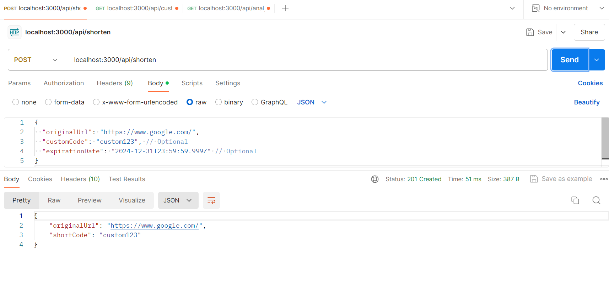
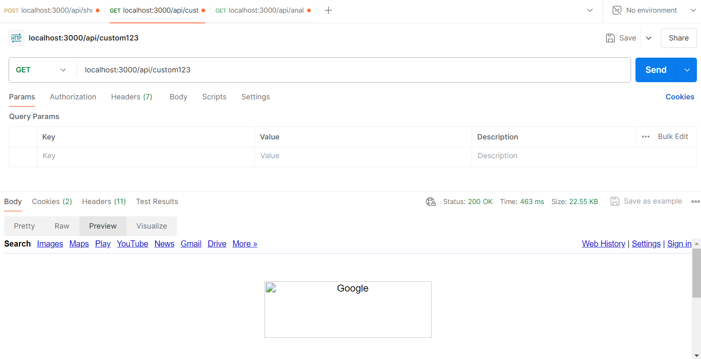
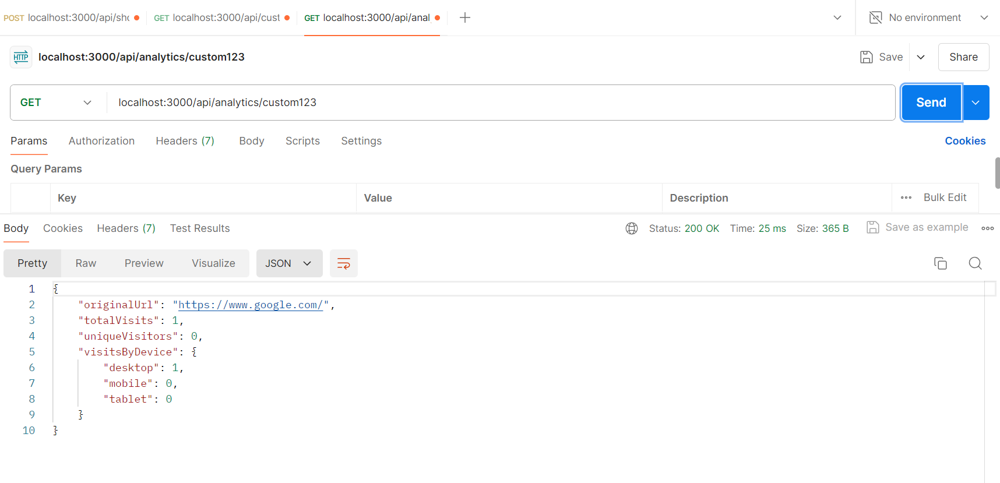

URL Shortener API 

This project implements a powerful URL shortener API with advanced analytics capabilities using Node.js, Express, MongoDB, Redis, and Bull for background jobs.

Table of Contents
Introduction
Features
Getting Started
Prerequisites
Installation
Configuration
Usage
Endpoints
Request and Response Formats
Advanced Features
Custom Short Codes
URL Expiration
Rate Limiting
Background Jobs
Database Schema
Contributing
License
Introduction
This API provides functionalities to shorten URLs, track visits with detailed analytics, and manage shortened links efficiently. It supports custom short codes, URL expiration, rate limiting, and background jobs for asynchronous tasks.

Features
URL Shortening: Shorten long URLs to compact forms.
Advanced Tracking: Track visits with timestamp, user agent, IP address, and device type.
Analytics: Retrieve detailed analytics including total visits, unique visitors, visits by device type, and more.
Custom Short Codes: Allow users to specify custom short codes for URLs.
URL Expiration: Implement URL expiration after a specified time.
Rate Limiting: Prevent abuse with rate limits for URL shortening requests.
Background Jobs: Use Bull for handling background tasks such as visit data aggregation.
Getting Started
Prerequisites
Node.js
MongoDB
Redis

Installation
 1.Clone the repository:
 git clone https://github.com/AmanMalviya22/url-shortener-api.git
 cd url-shortener-api

 2.Install dependencies:
   npm install

 3.Configuration
    Set up environment variables:
    Create a .env file based on .env.example and configure MongoDB and Redis connection details.
    PORT=3000
    MONGO_URI=mongodb://localhost:27017/urlshortener
    REDIS_URL=redis://localhost:6379

Usage
Endpoints
    POST localhost:3000/api/shorten: Shorten a URL.
    GET localhost:3000/api/:shortCode: Redirect to the original URL and track visit.
    GET localhost:3000/api/analytics/:shortCode: Retrieve analytics for a shortened URL

Request and Response Formats : Refer these postman screenshot
      
   
   